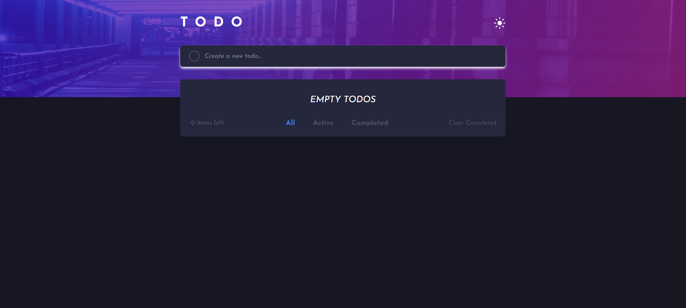

# Frontend Mentor - Todo app solution

This is a solution to the [Todo app challenge on Frontend Mentor](https://www.frontendmentor.io/challenges/todo-app-Su1_KokOW). Frontend Mentor challenges help you improve your coding skills by building realistic projects. 

## Table of contents

- [Overview](#overview)
  - [The challenge](#the-challenge)
  - [Screenshot](#screenshot)
  - [Links](#links)
- [My process](#my-process)
  - [Built with](#built-with)
  - [What I learned](#what-i-learned)
  - [Continued development](#continued-development)
- [Author](#author)

## Overview

### The challenge

Users should be able to:

- View the optimal layout for the app depending on their device's screen size
- See hover states for all interactive elements on the page
- Add new todos to the list
- Mark todos as complete
- Delete todos from the list
- Filter by all/active/complete todos
- Clear all completed todos
- Toggle light and dark mode
- **Bonus**: Drag and drop to reorder items on the list

### Screenshot



### Links

- Solution URL: [Github](https://github.com/Diego2Drm/todo-app-main)
- Live Site URL: [Todo App](https://diego2drm.github.io/todo-app-main/)

## My process

### Built with

### Built with

- Semantic HTML5 markup
- CSS custom properties
- Flexbox
- Mobile-first workflow
- [React](https://reactjs.org/) - JS library
- [Tailwind CSS v3.4](https://tailwindcss.com/docs/installation/using-vite) - For styles


### What I learned

I learned LocalStorage

```jsx
  const [todos, saveTodos] = useLocalStorage('TODOS', []);
  const [filterTodos, setFilterTodos] = useLocalStorage('TODOS', [])

export function useLocalStorage(itemName, initialValue) {
  const localStorageItem = localStorage.getItem(itemName);

  let parsedItem;

  if (!localStorageItem) {
    localStorage.setItem('TODOS', JSON.stringify(initialValue));
    parsedItem = initialValue;
  } else {
    parsedItem = JSON.parse(localStorageItem)
  }
  const [item, setItem] = React.useState(parsedItem);
  const [itemFilter, setItemFilter] = React.useState(parsedItem);

  const saveItem = (newItem) => {
    localStorage.setItem('TODOS', JSON.stringify(newItem));
    setItem(newItem);
    setItemFilter(newItem)
  }

  return [item, saveItem, itemFilter ];
}
```

### Continued development

"Keep studying LocalStorage and use it as a custom hook." 

## Author

- Website - [Diego Ramírez](https://diego2drm.github.io/Portafolio/)
- Frontend Mentor - [@Diego2Drm](https://www.frontendmentor.io/profile/Diego2Drm)
- Gmail - [diego.ramirez2d03@gmail.com]